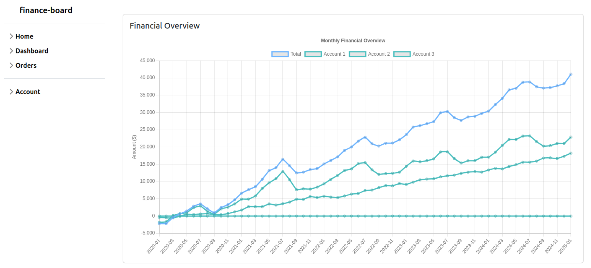
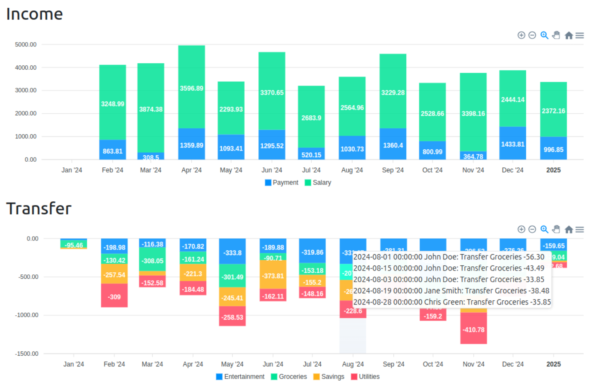

# Finance Board

A simple finance board for personal use.

Currently a work in progress.

It supports several banks and accounts.
It uses a local PostgreSQL database to store the data and a Flask backend to serve the data.

Displays the transactions per month with details over tooltips.

## Data Import

- Desktop
  - 
- Mobile
  - 

## Installation

1. Clone the repository.
2. Install the dependencies defined in pyproject.toml.
3. Create the PostgreSQL database.
4. Define the environment variables in `.env` defined in `.env.example`.
5. Generate a self signed `cert.pem` and `key.pem` with `openssl req -x509 -newkey rsa:2048 -nodes -keyout key.pem -out cert.pem -days 365`
6. Run the Flask backend `main.py`.
