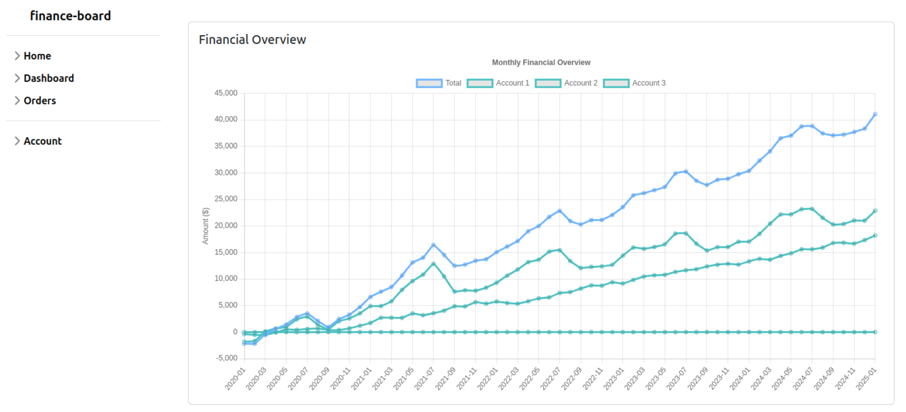
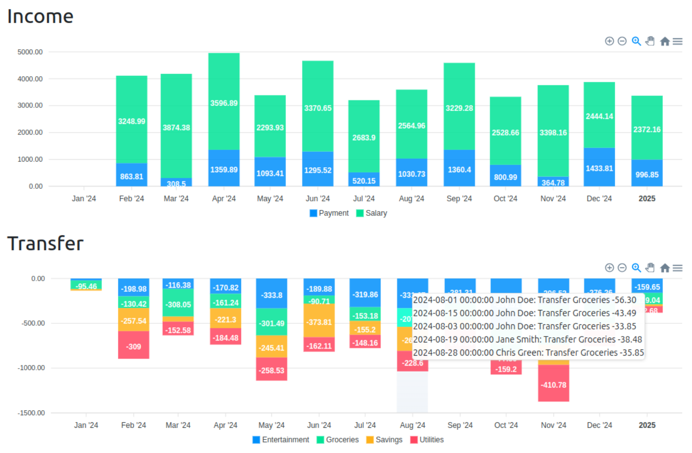

# Finance Board


A simple finance board for personal use.

Currently a work in progress.

It supports several banks and accounts.
It uses a local PostgreSQL database to store the data and a FastAPI/Uvicorn backend to serve the data.



Displays the transactions per month with details over tooltips.



## Data Import

- Desktop
  - [](https://www.youtube.com/watch?v=rdT5S6Wx1_Q)
- Mobile
  - [](https://www.youtube.com/watch?v=u1pUBUBylOU)

## Installation

### Docker (recommended — NAS / UGOS Pro / Debian server)

The Docker image only contains the Python dependencies. The source code is read directly from the git clone on the host via a bind mount, so updating the app never requires rebuilding the image.

**First-time setup:**

```shell
git clone <repo-url> finance-board
cd finance-board
cp .env.example .env          # fill in API keys; DB URI is handled by Compose
docker compose up --build -d
```

The app is available at `http://<host-ip>:8000`.

**Updating after a code change:**

```shell
git pull
docker compose restart web    # applies immediately — no rebuild needed
```

**Updating after a dependency change** (`pyproject.toml` / `poetry.lock` changed):

```shell
git pull
docker compose up --build -d  # rebuild image to install new packages
```

PostgreSQL data is stored in a Docker named volume (`postgres_data`) and persists across restarts and `docker compose down`. Running `docker compose down -v` will permanently delete the volume and all data.

### Local (manual)

1. Clone the repository.
2. Install the dependencies defined in `pyproject.toml`.
3. Create the PostgreSQL database.
4. Define the environment variables in `.env` defined in `.env.example`.
5. Generate a self signed `cert.pem` and `key.pem` with `openssl req -x509 -newkey rsa:2048 -nodes -keyout key.pem -out cert.pem -days 365`
6. Run the backend: `python main.py`.

## Coverage

```shell
pytest --cov=. --cov-report=html tests/
```
